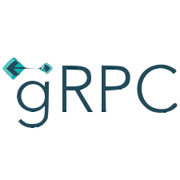

<div align="center">
  
</div>

<div align="center">
  <a href="#about">About</a>
   &nbsp;&nbsp;&nbsp;|&nbsp;&nbsp;&nbsp;
  <a href="#techs">Techs</a>
  &nbsp;&nbsp;&nbsp;|&nbsp;&nbsp;&nbsp;
  <a href="#run">Run</a>
&nbsp;&nbsp;&nbsp;|&nbsp;&nbsp;&nbsp;
  <a href="#commands">Commands</a>
  &nbsp;&nbsp;&nbsp;|&nbsp;&nbsp;&nbsp;
  <a href="#license">License</a>
</div>

## About

Simple gRPC Key Value storage application

## Techs

- Golang `1.16.2`
- gRPC `1.35.0`
- Cobra `1.1.3`

## Run

### Clone the repository

```bash
# Clone Repository
$ git clone https://github.com/PUC-DISCIPLINAS/kv-grpc-gamoch-ianbandrade.git
```

### Run Server

```bash
# Go to folder
$ cd kv-grpc-gamoch-ianbandrade/server

# Install the dependencies
$ go mod vendor

# Start the server
$ go run main.go
```

The console going to show the result

### Run Client

```bash
# Go to folder
$ cd kv-grpc-gamoch-ianbandrade/client

# Install the dependencies
$ go mod vendor
```

#### Client commands

Commands are built by a modern Go CLI interactions - [Cobra](https://github.com/spf13/cobra)

#### Usage

You just need to type on Client folder one of this commands below, passing them following args:

`go run main put [key] [value]` - Put a KeyValue object into a server

`go run main.go get [key]` - Get an object value as from your key

`go run main.go GetAllKeys` - Get all Keys

The console going to show the results

## License

This project is under the MIT license. See the file [LICENSE](LICENSE) for more details.
